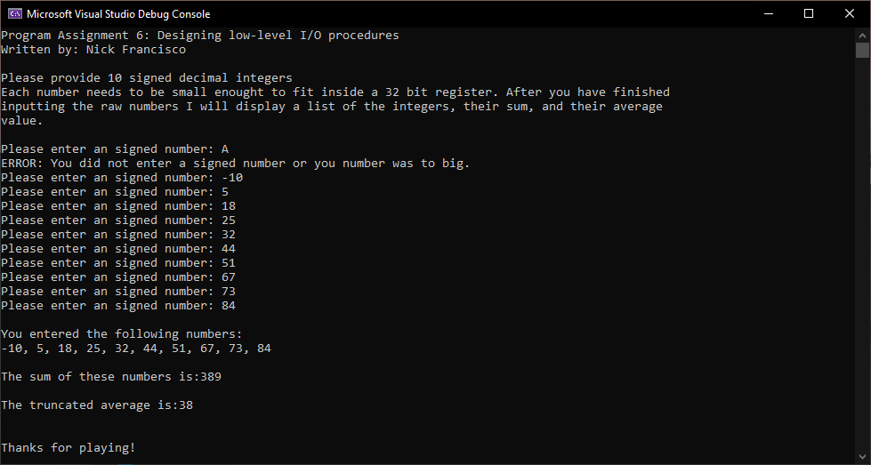

# CS 271 Computer Architecture and Assembly Language  
MASM input and output macros for signed integers using an array for storage.

## Assignment Info 
- User’s numeric input must be validated the hard way:
  - Read the user's input as a string and convert the string to numeric form.
  - If the user enters non-digits other than something which will indicate sign (e.g. ‘+’ or ‘-‘), or the number is too large for 32-bit registers, an error message should be displayed and the number should be discarded.
  - If the user enters nothing (empty input), display an error and re-prompt.
- ReadInt, ReadDec, WriteInt, and WriteDec are not allowed in this program.
- Conversion routines must appropriately use the LODSB and/or STOSB operators for dealing with strings.
- All procedure parameters must be passed on the runtime stack using the STDCall calling convention. Strings also must be passed by reference.
- Prompts, identifying strings, and other memory locations must be passed by address to the macros.
- Used registers must be saved and restored by the called procedures and macros.
- The stack frame must be cleaned up by the called procedure.
- Procedures (except main) must not reference data segment variables by name. There is a significant penalty attached to violations of this rule.  Some global constants (properly defined using EQU, =, or TEXTEQU and not redefined) are allowed. These must fit the proper role of a constant in a program (master values used throughout a program which, similar to HI and LO in Project 5).
- The program must use Register Indirect addressing for integer (SDWORD) array elements, and Base+Offset addressing for accessing parameters on the runtime stack.
- Procedures may use local variables when appropriate.
- The program must be fully documented and laid out according to the CS271 Style Guide. This includes a complete header block for identification, description, etc., a comment outline to explain each section of code, and proper procedure headers/documentation.

## Screenshot

